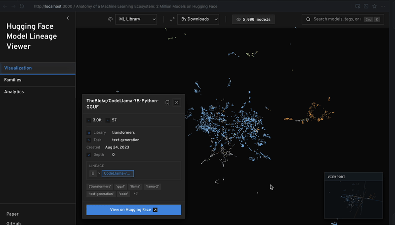

# Anatomy of a Machine Learning Ecosystem: 2 Million Models on Hugging Face

**Authors:** Benjamin Laufer, Hamidah Oderinwale, Jon Kleinberg

**Research Paper**: [arXiv:2508.06811](https://arxiv.org/abs/2508.06811)

**Live Demo**: [https://huggingface.co/spaces/midah/hf-viz](https://huggingface.co/spaces/midah/hf-viz)

## Abstract

Many have observed that the development and deployment of generative machine learning (ML) and artificial intelligence (AI) models follow a distinctive pattern in which pre-trained models are adapted and fine-tuned for specific downstream tasks. However, there is limited empirical work that examines the structure of these interactions. This paper analyzes 1.86 million models on Hugging Face, a leading peer production platform for model development. Our study of model family trees -- networks that connect fine-tuned models to their base or parent -- reveals sprawling fine-tuning lineages that vary widely in size and structure. Using an evolutionary biology lens to study ML models, we use model metadata and model cards to measure the genetic similarity and mutation of traits over model families. We find that models tend to exhibit a family resemblance, meaning their genetic markers and traits exhibit more overlap when they belong to the same model family. However, these similarities depart in certain ways from standard models of asexual reproduction, because mutations are fast and directed, such that two `sibling' models tend to exhibit more similarity than parent/child pairs. Further analysis of the directional drifts of these mutations reveals qualitative insights about the open machine learning ecosystem: Licenses counter-intuitively drift from restrictive, commercial licenses towards permissive or copyleft licenses, often in violation of upstream license's terms; models evolve from multi-lingual compatibility towards english-only compatibility; and model cards reduce in length and standardize by turning, more often, to templates and automatically generated text. Overall, this work takes a step toward an empirically grounded understanding of model fine-tuning and suggests that ecological models and methods can yield novel scientific insights.

## About This Tool

This interactive latent space navigator visualizes ~1.84M models from the [modelbiome/ai_ecosystem_withmodelcards](https://huggingface.co/datasets/modelbiome/ai_ecosystem_withmodelcards) dataset in a 2D space where similar models appear closer together, allowing you to explore the relationships and family structures described in the paper.



**Resources:**
- **GitHub Repository**: [bendlaufer/ai-ecosystem](https://github.com/bendlaufer/ai-ecosystem) - Original research repository with analysis notebooks and datasets
- **Hugging Face Project**: [modelbiome](https://huggingface.co/modelbiome) - Dataset and project page on Hugging Face Hub

## Quick Start (Pre-Computed Data)

This project now uses **pre-computed embeddings and coordinates** for instant startup:

### Option 1: Pre-Computed Data (Recommended - 10 seconds startup)

```bash
# 1. Generate pre-computed data (one-time, ~45 minutes)
cd backend
pip install -r config/requirements.txt
python scripts/precompute_data.py --sample-size 150000

# 2. Start backend (instant!)
uvicorn api.main:app --host 0.0.0.0 --port 8000

# 3. Start frontend
cd ../frontend
npm install && npm start
```

**Startup time:** ~5-10 seconds

### Option 2: Traditional Mode (Fallback)

If pre-computed data is not available, the backend will automatically fall back to traditional loading (slower but still functional).

**See:** 
- [`PRECOMPUTED_DATA.md`](PRECOMPUTED_DATA.md) - Detailed documentation
- [`DEPLOYMENT.md`](DEPLOYMENT.md) - Production deployment guide

## Project Structure

```
hf_viz/
├── backend/              # FastAPI backend
│   ├── api/             # API routes (main.py)
│   ├── services/        # External services (arXiv, model tracking, scheduler)
│   ├── utils/           # Utility modules (data loading, embeddings, etc.)
│   ├── config/          # Configuration files
│   └── cache/           # Backend cache directory
├── frontend/            # React frontend
│   ├── src/
│   │   ├── components/  # React components
│   │   ├── utils/       # Frontend utilities
│   │   └── workers/     # Web Workers
│   └── public/          # Static assets
├── cache/               # Shared cache directory
├── deploy/              # Deployment configuration files
└── netlify-functions/   # Netlify serverless functions
```

## Features

### 3D Latent Space Visualization

- **Interactive 3D Scatter Plot** (Three.js/React Three Fiber):
  - Navigate 1.84M+ models in 3D space
  - Spatial sparsity filtering for better navigability
  - Frustum culling and adaptive sampling for performance
  - Instanced rendering for large datasets
  - Family tree visualization with connecting edges
  - Multiple color encoding options (library, pipeline, cluster, family depth, popularity)
  - Dynamic size encoding based on downloads/likes
  - Smooth camera animations
  - UV projection minimap for navigation

### 2D Visualizations (D3.js)

- **Enhanced Scatter Plot**: 
  - Brush selection for multi-model selection
  - Real-time tooltips with model details
  - Dynamic color and size encoding
  - Interactive zoom and pan
  - Click to view model details modal

- **Network Graph**: 
  - Force-directed layout showing model relationships
  - Connectivity based on latent space similarity
  - Draggable nodes
  - Color-coded by library
  - Node size based on popularity

- **Histograms**: 
  - Distribution analysis of downloads, likes, trending scores
  - Interactive bars with hover details
  - Dynamic attribute selection

- **UV Projection Minimap**:
  - 2D projection of 3D latent space (XY plane)
  - Click to navigate 3D view to specific regions
  - Shows current view center

### Advanced Features

- **Semantic Similarity Search**: Find models similar to a query model using embeddings
- **Base Models Filter**: View only root models (no parent) to see the base of family trees
- **Family Tree Visualization**: Click any model to see its family tree with parent-child relationships
- **Clustering**: Automatic K-means clustering reveals semantic groups
- **Model Details Modal**: 
  - Comprehensive model information
  - File tree browser
  - Color-coded tags and licenses
  - Links to Hugging Face Hub

### Model Tracking & Analytics

- **Live Model Count Tracking**: Track the number of models on Hugging Face Hub over time
- **Growth Statistics**: Calculate growth rates, daily averages, and trends
- **Historical Data**: Query historical model counts with breakdowns by library and pipeline
- **API Endpoints**: RESTful API for accessing tracking data

### Performance Optimizations

- **Real-time Updates**: 
  - Debounced search (300ms)
  - Instant filter updates
  - Dynamic visualization switching
- **Client-side Caching**: IndexedDB caching for API responses
- **Request Cancellation**: Prevents race conditions with concurrent requests
- **Adaptive Rendering**: Quality adjusts based on user interaction
- **Spatial Indexing**: Octree for efficient nearest neighbor queries

## Quick Start

**Start Backend:**
```bash
cd backend
pip install -r config/requirements.txt
uvicorn api.main:app --reload --host 0.0.0.0 --port 8000
```

**Start Frontend:**
```bash
cd frontend
npm install
npm start
```

Opens at `http://localhost:3000` with full D3.js interactivity.

## Installation

**Backend:**
```bash
cd backend
pip install -r config/requirements.txt
```

**Frontend:**
```bash
cd frontend
npm install
```

## Usage

### Local Development

**Start Backend:**
```bash
cd backend
uvicorn api.main:app --reload --host 0.0.0.0 --port 8000
```

The backend will:
1. Load a sample of 10,000 models from the dataset
2. Generate embeddings (first run takes ~2-3 minutes)
3. Reduce dimensions using UMAP
4. Serve the API at `http://localhost:8000`

**Start Frontend:**
```bash
cd frontend
npm start
```

The frontend will open at `http://localhost:3000`

### Using the Interface

1. **Filters**: Use the left sidebar to filter models by:
   - Search query (model ID or tags)
   - Minimum downloads
   - Minimum likes
   - Color mapping (library, pipeline, popularity)
   - Size mapping (downloads, likes, trending score)

2. **Exploration**: 
   - Hover over points to see model information
   - Zoom and pan to explore different regions
   - Use the legend to understand color coding

3. **Understanding the Space**:
   - Models closer together are more similar
   - Similarity is based on tags, pipeline type, library, and model card content

## Deployment

### Netlify (React Frontend)

The frontend is configured for deployment on Netlify. The `netlify.toml` file in the root directory contains the build configuration.

**Steps to Deploy:**

1. **Push your code to GitHub** (if not already):
   ```bash
   git add .
   git commit -m "Prepare for Netlify deployment"
   git push origin main
   ```

2. **Connect to Netlify**:
   - Go to [Netlify](https://app.netlify.com)
   - Click "Add new site" → "Import an existing project"
   - Connect your GitHub repository
   - Netlify will auto-detect the `netlify.toml` configuration

3. **Configure Environment Variables**:
   - In Netlify dashboard, go to Site settings → Environment variables
   - Add `REACT_APP_API_URL` with your backend URL (e.g., `https://your-backend.railway.app`)
   - If using Hugging Face API, add `REACT_APP_HF_TOKEN` (optional)

4. **Deploy Backend Separately**:
   - Netlify doesn't support Python/FastAPI backends
   - Deploy backend to one of these services:
     - **Railway**: Recommended, easy setup
     - **Render**: Free tier available
     - **Fly.io**: Good for Python apps
     - **Heroku**: Paid option
   - Update CORS in `backend/api/main.py` to include your Netlify URL

5. **Build Settings** (auto-detected from `netlify.toml`):
   - Base directory: `frontend`
   - Build command: `npm install && npm run build`
   - Publish directory: `frontend/build`
   - Node version: 18

**Backend Deployment (Railway Example):**

1. Create a new project on [Railway](https://railway.app)
2. Connect your GitHub repository
3. Set root directory to `backend`
4. Railway will auto-detect Python and install dependencies
5. Add environment variables if needed (HF_TOKEN, etc.)
6. Railway will provide a URL like `https://your-app.railway.app`
7. Use this URL as `REACT_APP_API_URL` in Netlify

**CORS Configuration:**

Update `backend/api/main.py` to allow your Netlify domain:
```python
from fastapi.middleware.cors import CORSMiddleware

app.add_middleware(
    CORSMiddleware,
    allow_origins=[
        "http://localhost:3000",  # Local development
        "https://your-site.netlify.app",  # Your Netlify URL
    ],
    allow_credentials=True,
    allow_methods=["*"],
    allow_headers=["*"],
)
```

## Architecture

- **Backend** (`backend/api/main.py`): FastAPI server serving model data
- **Frontend** (`frontend/`): React app with D3.js visualizations
  - **Enhanced Scatter Plot**: D3.js scatter with brush selection, real-time tooltips
  - **Network Graph**: Force-directed graph showing model relationships and connectivity
  - **Histograms**: Distribution analysis of downloads, likes, trending scores
  - **Real-time Updates**: Debounced filtering, dynamic visualizations
  - **Interactive Features**: Click, brush, drag, zoom, pan
- **Data Loading** (`backend/utils/data_loader.py`): Loads dataset from Hugging Face Hub, handles filtering and preprocessing
- **Embedding Generation** (`backend/utils/embeddings.py`): Creates embeddings from model metadata using sentence transformers
- **Dimensionality Reduction** (`backend/utils/dimensionality_reduction.py`): Uses UMAP to reduce to 2D for visualization
- **Clustering** (`backend/utils/clustering.py`): K-Means clustering with automatic optimization for model grouping
- **Services** (`backend/services/`): External service integrations (arXiv API, model tracking, scheduler)

### Comparison with Hugging Face Dataset Viewer

This project uses a different approach than Hugging Face's built-in dataset viewer:

- **HF Dataset Viewer**: Tabular browser for exploring dataset rows (see [dataset-viewer](https://github.com/huggingface/dataset-viewer))
- **This Project**: Latent space visualization showing semantic relationships between models

The HF viewer is optimized for browsing data structure, while this tool focuses on understanding model relationships through embeddings and spatial visualization.

## Design Decisions

The application uses:
- **3D visualization** for immersive exploration of latent space with **2D fallbacks** for accessibility
- **UMAP** for dimensionality reduction (better global structure than t-SNE, optimized parameters for structure preservation)
- **Sentence transformers** for efficient embedding generation
- **Smart sampling** with spatial sparsity to maintain interactivity with large datasets
- **Multi-level caching** (disk + IndexedDB) to avoid recomputation on filter changes
- **Adaptive rendering** with frustum culling and level-of-detail for smooth performance
- **Instanced rendering** for efficient GPU utilization with large point clouds

## Performance Notes

- **Full Dataset**: Loads all ~1.86 million models from the dataset
- **Backend Sampling**: Requests up to 500,000 models from backend (configurable via `max_points` API parameter)
- **Frontend Rendering**: 
  - For datasets >400K: Shows 30% of models (up to 200K visible)
  - For datasets 200K-400K: Shows 40% of models
  - For datasets 100K-200K: Shows 50% of models
  - For smaller datasets: Shows all models with adaptive spatial sparsity
  - Uses instanced rendering for datasets >5K points
  - Camera-based frustum culling and adaptive LOD for optimal performance
- **Embedding Model**: `all-MiniLM-L6-v2` (good balance of quality and speed)
- **Caching**: Embeddings and reduced dimensions are cached to disk for fast startup
- **Optimizations**: Index-based lookups, vectorized operations, response compression, and optimized top-k queries

## Requirements

- Python 3.8+
- ~2-4GB RAM for 10K models
- Internet connection for dataset download
- Optional: GPU for faster embedding generation (not required)

## Citation

If you use this tool or dataset, please cite:

```bibtex
@article{laufer2025anatomy,
  title={Anatomy of a Machine Learning Ecosystem: 2 Million Models on Hugging Face},
  author={Laufer, Benjamin and Oderinwale, Hamidah and Kleinberg, Jon},
  journal={arXiv preprint arXiv:2508.06811},
  year={2025},
  url={https://arxiv.org/abs/2508.06811}
}
```

**Paper**: [arXiv:2508.06811](https://arxiv.org/abs/2508.06811)
